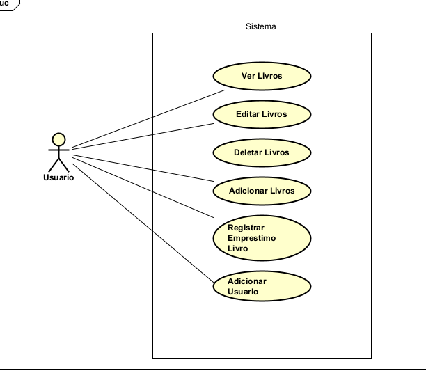
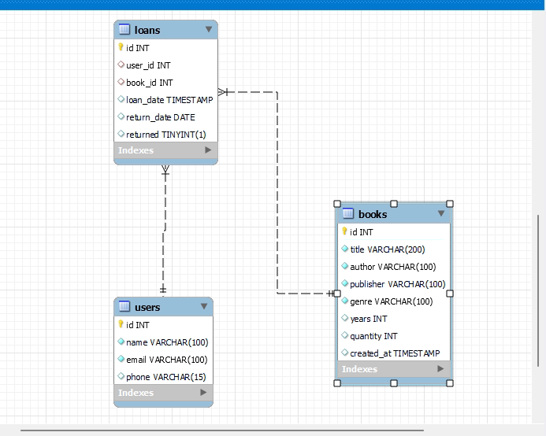

# Projeto Biblioteca:

    O projeto é um sistema basico de registro de usuarios e livros, onde esta sendo feito o controle
    de emprestimos... além de um crud (criação, visualização, edição e exclusão) dos items que pertencem ao sistema.
    O mesmo foi criado em Java utilizando servelets e como gerenciador de banco de dados o Mysql.

## Diagrama de casos de Uso:





## Banco de Dados:

### Estrutura Banco de Dados:




### Script para a criação do Banco de dados:


```
create database Library;
use Library;

CREATE TABLE users (
    id INT AUTO_INCREMENT PRIMARY KEY,
    name VARCHAR(100) NOT NULL,
    email VARCHAR(100) UNIQUE NOT NULL,
    phone VARCHAR(15)
);

CREATE TABLE books (
    id INT AUTO_INCREMENT PRIMARY KEY,
    title VARCHAR(200) NOT NULL,
    author VARCHAR(100) NOT NULL,
    publisher VARCHAR(100) NOT NULL,
    genre VARCHAR(100) NOT NULL,
    years int,
    quantity INT DEFAULT 1,
    created_at TIMESTAMP DEFAULT CURRENT_TIMESTAMP
);

CREATE TABLE loans (
    id INT AUTO_INCREMENT PRIMARY KEY,
    user_name VARCHAR(200),
    book_name VARCHAR(100),
    loan_date DATE,
    return_date DATE,
    returned BOOLEAN DEFAULT FALSE
);


```


## Padrão MVC 


### Model:
Arquivos pertencentes:
* BookDAO.java
* BookDTO.java
* Database.java
* LoanDAO.java
* LoanDTO.java
* UserDAO.java
* UserDTO.java

### Controller:
Arquivos pertencentes:
* AddBookServlet.java
* AddUserServlet.java
* DeleteBookServlet.java
* EditBookServlet.java
* ListBookServlet.java
* LoanServlet.java


### View: 
Arquivos pertencentes:
* addBook.jsp
* addLoan.jsp
* addUser.jsp
* bookSuccess.jsp
* deleteBook.jsp
* editBook.jsp
* index.jsp
* listBooks.jsp
* listLoans.jsp
* loanSuccess.jsp
* updateLoanStatus.jsp
* userSuccess.jsp


[*Video apresentação*](https://drive.google.com/file/d/1-l_dd0zOgFUVkohSzH_VHpijmpiFyq2a/view?usp=sharing)
